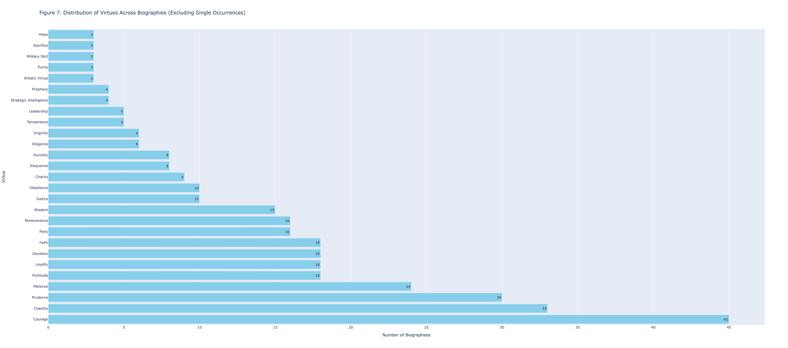

# Las mujeres desde la perspectiva de Álvaro de Luna: ¿un progresista o un hombre de su tiempo? 

La virtud de la castidad se presenta en el *Libro de las virtuosas e claras mujeres* de Álvaro de Luna, juntamente con muchas otras virtudes. La castidad, entendida en el siglo XV como una virtud femenina esencial, se convierte en el Libro en un reflejo del control patriarcal sobre el cuerpo de la mujer. Sin embargo, una lectura contemporánea revela contradicciones en esta representación. En este ensayo, analizo la castidad que presenta Luna como producto de la edad medieval y la comparo con los estándares de hoy. En fin, concluyo con un comentario sobre la objetividad de los datos

En su obra, escrita en el año 1446 y profundamente arraigada en la cultura católica, no resulta extraño que la castidad sea la segunda virtud más representada en el libro de Luna, un noble, y católico, como el Rey Juan II, que pertenecía a una cultura cuya imagen más alta de la figura femenina era la Virgen María, que nunca perdió su virginidad, pero dio a luz a Jesús. Una mujer en ese siglo no tenía casi ninguna libertad para escoger su futuro, estaba decidido desde el momento de su nacimiento: ser esposa y/o madre. En este sentido, desde la perspectiva patriarcal, su valor se basaba en pocas cosas, predominantemente su cuerpo. Era importante que el cuerpo femenino se concibiera como propiedad del esposo. Todas las mujeres castas que presento en la próxima parte cumplen con esta expectativa y se aseguran de que sus esposos sean el único hombre que la toca.

Luna presenta una versión medieval de la castidad a través de las experiencias de tres mujeres: Lucrecia, la Reina Dido, y Judith. Lucrecia, después de haber sido violada por el hijo del rey, se comete suicidio como demostración de la importancia de su castidad. Según la lógica del texto, preserva su castidad, aunque podría considerarse una paradoja que la muerte sea una manera de poseer un atributo, ya que un éste se desarrolla a través de las acciones hechas en la vida- no una acción que termin a conla vida. De una manera parecida, la Reina Dido pierde a su esposo y es amenazada si no aceptaba casarse con el rey local. Como resultado, ella también se suicida, prefiriendo la muerte sobre la obligación de tener relaciones con otro hombre. Cabe destacar que los dos personajes eran supuestamente castos por elegir la muerte en lugar de permitir que otro hombre tenga su cuerpo. Las dos se suicidan, la Reina Dido lo hace de una manera preventiva, mientras que Lucrecia lo hizo de manera reactiva. 

Por otra parte, la historia de Judith retrata a una mujer casta, pero no a costa de su vida, y, por lo tanto, considero que ella es la única sensata de las tres. En la biografía, Holofernes, un general que amenaza el pueblo de Judith, la desea. Ella no sólo se niega a los avances sexuales de Holofernes, sino que lo mata y salva su ciudad en el proceso. Se podría argumentar que, al seducir a un hombre, Judith no es de manera casta. A esto planteo una pregunta, ¿debe ser considerado un asesino si alguien mata a otra persona en defensa propia? ¿A esa persona le falta la virtud de la compasión? Así, Judith no renuncia a su castidad cuando seduce a Holofernes, ya que es en defensa de sí misma y su ciudad. De esta manera, Judith es casta y, además, una heroína. 

Hoy en día la sociedad percibe el suicidio como algo terrible que se debe evitar a toda costa. Por eso, existen líneas de ayuda y recursos para apoyar a la gente que considera cometer el acto. Si una mujer virtuosa debe comportarse de una manera moral y buena, una que comete una acción espantosa como el suicido no puede ser considerada virtuosa en la época actual. Además, en la edad media, el suicido era considerado un pecado. Por lo tanto, es curioso que estas mujeres, que pecan, son retratadas como virtuosas por un hombre católico. Según lo veo yo, Judith es el único personaje verdaderamente virtuoso. 

Las visualizaciones han hecho posible realizar una “lectura distante”, que es una manera útil de sintetizar información no relacionada para que surjan patrones claros. Sin visualizaciones como la Figura 7, un lector quizás presumiría que la castidad es la virtud más popular, sin embargo, esta figura nos presenta los números exactos para crear una comprensión precisa de la frecuencia de las virtudes en la colección. Pero, ¿verdaderamente muestra la realidad? Con un análisis más profundo de la visualización, algunos aspectos me hacen cuestionar la intención del gráfico por ejemplo, ¿que definiciones se utilizan y como se han decidido? Al matarse para que ningún otro hombre pueda tenerla, argumento que la Reina Dido hace un gran acto de lealtad hacía su esposo. Sin embargo, el gráfico no la incluye en la barra de “lealtad”. Así, los datos variarán según la metodología empleada. En este sentido, “los datos” que muestran las visualizaciones solo son datos para alguien que esté de acuerdo con todas las opiniones del creador. Esto nos lleva a responder una pregunta crítica en las humanidades: ¿es posible que existan datos objetivos? Creo que cualquier dato que se derive de algo creado por el ser humano no es un verdadero dato. Pero esto nos lleva a algo más existencial, ¿existen datos no producido por el hombre? La virtud femenina es meramente una construcción social y este análisis muestra cómo ha evolucionado la noción de la mujer virtuosa a lo largo de los siglos. Es seguro que la definición va a continuar desarrollándose. Así, hay que ser precavidos con los datos, es decir no deben aceptarse de inmediato como hechos, pues evolucionan como cada ser, concepto, y valor. 

